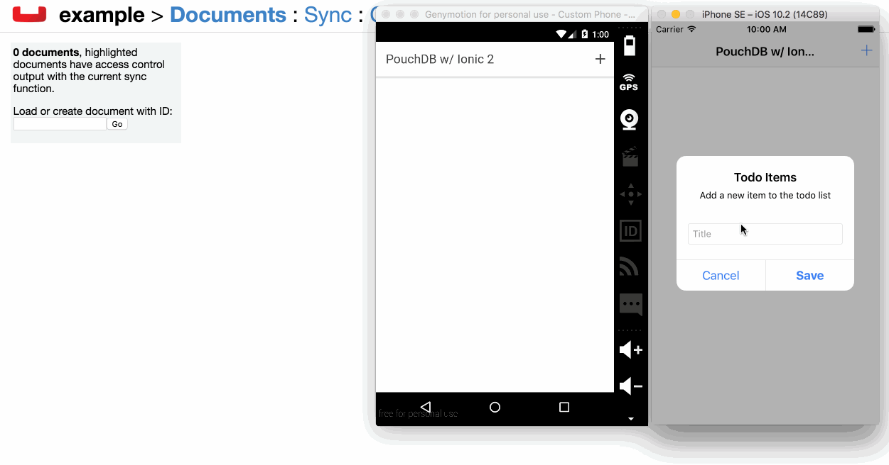

# Couchbase with Ionic 2 and PouchDB Example

This example demonstrates data synchronization between platforms and devices in Ionic 2 mobile applications using Couchbase and PouchDB.



## Installation and Configuration

After downloading this project, the dependencies, platforms, and plugins can be restored by executing the following commands:

```
npm install
ionic state restore
```

This demo does make use of data synchronization which requires the use of Couchbase Sync Gateway.  After downloading Sync Gateway, launch it using the provided **sync-gateway-config.json** configuration file.  Launching can be done like so:

```
/path/to/sync_gateway /path/to/sync-gateway-config.json
```

With Sync Gateway running, alter the project's **src/pages/home/home.ts** file to reflect the hostname used.  At this point the application can be built and run.

## Resources

Couchbase - [http://www.couchbase.com](http://www.couchbase.com)

Ionic Framework - [http://www.ionicframework.com](http://www.ionicframework.com)

Couchbase Lite + Ionic 2 Example - [https://github.com/couchbaselabs/todolite-ionic2](https://github.com/couchbaselabs/todolite-ionic2)

The Polyglot Developer - [https://www.thepolyglotdeveloper.com](https://www.thepolyglotdeveloper.com)